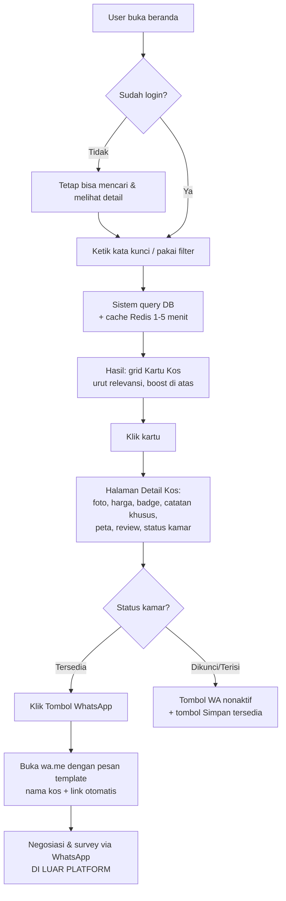
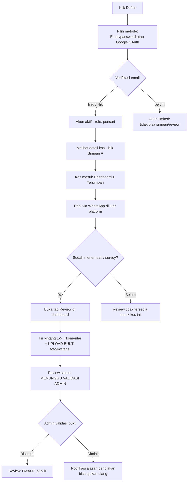
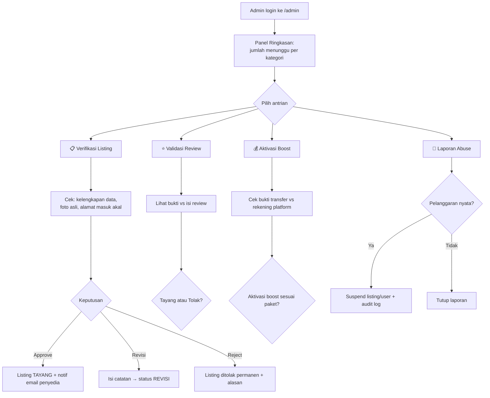
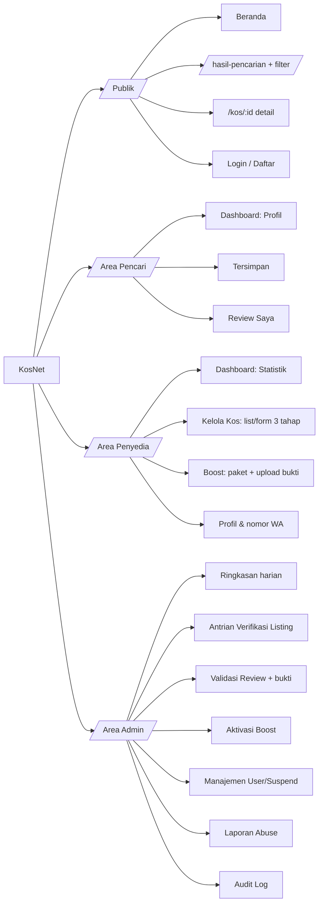

# Sistem Desain — KosNet
**Versi:** 0.1 · **Tanggal:** 2026-08-25 · **Prasyarat:** PRD v0.2 & Arsitektur disetujui
**Bahasa UI:** Indonesia · **Platform:** Web responsive + PWA (desktop & mobile-first)

Dokumen ini terbagi 3 bagian besar:
1. **Design Tokens** — fondasi visual (warna, huruf, spacing)
2. **Komponen Inti** — potongan UI yang dipakai berulang
3. **Wireframe & Flowchart per Lingkungan** — dipisah: Publik, Pencari Kos, Penyedia Kos, Admin

---

# BAGIAN 1 — DESIGN TOKENS

## 1.1 Warna

> Prinsip: hijau = identitas merek (asosiasi "rumah/tumbuh"), kuning = aksi WhatsApp, merah = status penuh/bahaya. Warna dipakai hemat — yang penting konten (foto kos) jadi bintangnya.

| Token | Nilai | Kegunaan |
|---|---|---|
| `--primary` | `#16A34A` | Tombol utama, link, brand (hijau) |
| `--primary-dark` | `#15803D` | Hover tombol utama |
| `--primary-light` | `#DCFCE7` | Background badge/section highlight |
| `--wa` | `#25D366` | Tombol "Chat WhatsApp" (identik warna WA agar dikenali instan) |
| `--secondary` | `#0F172A` | Teks judul, footer (biru gelap hampir hitam) |
| `--muted` | `#64748B` | Teks sekunder, placeholder |
| `--bg` | `#F8FAFC` | Latar halaman |
| `--card` | `#FFFFFF` | Kartu listing, panel |
| `--border` | `#E2E8F0` | Garis pemisah kartu/input |
| `--warning` | `#F59E0B` | Badge boost "Tersorot", catatan khusus |
| `--danger` | `#DC2626` | Status "Penuh/Dikunci", error, hapus |
| `--info` | `#3B82F6` | Status "Tersedia", info tip |

### Warna semantik status kamar
| Status | Warna | Dipakai di |
|---|---|---|
| Tersedia | `--info` (biru) | kartu kos, detail |
| Dikunci / Dibooking | `--warning` (kuning) | kartu kos, detail |
| Terisi / Penuh | `--danger` (merah) | kartu kos, detail |

## 1.2 Tipografi
Font: **Inter** (gratis via Google Fonts, sangat legible di layar kecil).

| Token | Ukuran | Kegunaan |
|---|---|---|
| H1 | 30px / bold | Judul halaman ("Kos di Yogyakarta") |
| H2 | 22px / semibold | Judul section, nama kos di detail |
| H3 | 17px / semibold | Nama kos di kartu |
| Body | 15px / regular | Deskripsi, teks umum |
| Small | 13px / regular | Caption, meta info ("2 km dari UGM") |

## 1.3 Spacing & Bentuk
- **Spacing scale:** 4 · 8 · 12 · 16 · 24 · 32 · 48 px (kelipatan 4).
- **Radius:** kartu 12px · tombol 8px · badge full-round.
- **Grid:** max-width konten desktop **1200px**; mobile = full-width + padding 16px.
- **Breakpoint:** `sm` 640px (HP) · `md` 768px (tablet) · `lg` 1024px (laptop) · `xl` 1280px (PC).
- **Sentuhan HP:** semua area klik min. **44×44px** (standar nyaman untuk jempol).

---

# BAGIAN 2 — KOMPONEN INTI

## 2.1 Kartu Kos (ListingCard) — komponen paling penting
Muncul di: hasil pencarian, beranda, dashboard favorit.

```
┌─────────────────────────┐
│ [FOTO]         ⭐4.8    │  ← foto pertama, rasio 4:3; badge rating pojok
│                         │     ikon ♥ simpan di pojok kanan atas
├─────────────────────────┤
│ Kost Putri Melati       │  ← H3
│ 📍 Kotagede, Yogyakarta │  ← small, muted
│ Rp 850.000 /bulan       │  ← harga BOLD (informasi #1 yang dicari)
│ [Putri] [AC] [WiFi] [+3]│  ← badge gender + 2 fasilitas + counter
│ 🔵 Tersedia             │  ← dot warna status kamar
└─────────────────────────┘
```

## 2.2 Badge Fasilitas
Pill abu-abu muda, ikon + label pendek: `AC` `WiFi` `KM Dalam` `Parkir` `Dapur` `Laundry` `Listrik Include`. Maksimal 4 tampil di kartu, sisanya `+N`.

## 2.3 Catatan Khusus (SpecialNote)
Kotak kuning muda dengan ikon ℹ️ di halaman detail:
> ⚠️ *Biaya listrik terpisah (ditanggung penyewa). Pembayaran bulanan tanggal 5.*

## 2.4 Tombol WhatsApp (WAButton) — CTA utama platform
```
┌──────────────────────────────┐
│ 💬 Chat WhatsApp Pemilik     │   background --wa (hijau WA), teks putih,
└──────────────────────────────┘   full-width di mobile, sticky bottom bar di HP
```
Klik → buka `wa.me/<nomor>?text=<pesan template>` berisi nama kos + link listing.

## 2.5 Filter Bar (SearchFilter)
Desktop: sidebar kiri sticky. Mobile: tombol "Filter" membuka bottom-sheet.
Isi: rentang harga (slider) · gender (radio: Pria/Wanita/Campur) · lokasi (provinsi→kota cascade) · fasilitas (checkbox) · status (checkbox: hanya tersedia).

## 2.6 Komponen lain
| Komponen | Kegunaan |
|---|---|
| RatingStars | bintang 1–5 readonly (tampil) & interaktif (input review) |
| EmptyState | ilustrasi + teks ("Belum ada kos yang cocok — coba longgarkan filter") |
| Toast | notifikasi ringan ("Tersimpan di favorit ✓") |
| Modal Konfirmasi | aksi destruktif (hapus listing, tolak listing admin wajib isi alasan) |
| UploadGambar | drag-drop + preview + urutan foto (drag to reorder), validasi maks 15 foto |
| SkeletonLoader | kotak abu animasi saat data loading — persepsi cepat |

---

# BAGIAN 3 — WIREFRAME & FLOWCHART PER LINGKUNGAN

Diagram dibuat dengan **Mermaid** — bisa dirender langsung di GitHub/VS Code (extension "Markdown Preview Mermaid Support").

---

## 3.A LINGKUNGAN PUBLIK (belum login)

### Wireframe Beranda
```
┌──────────────────────────────────────────┐
│ LOGO KosNet        [Cari Kos] [Masuk]    │ ← navbar
├──────────────────────────────────────────┤
│   Cari kos idamanmu 🔍                   │
│  ┌──────────────────────────────┐        │
│  │ "kos putri dekat UGM"  [🔍]  │        │ ← search hero + filter cepat
│  └──────────────────────────────┘        │
│  [Pria] [Wanita] [Campur]  Kota ▾       │
├──────────────────────────────────────────┤
│ Kos Tersorot ⭐                          │ ← slot boost (pendapatan!)
│ [kartu] [kartu] [kartu] [kartu]          │
├──────────────────────────────────────────┤
│ Jelajahi per Kota                        │
│ (Yogyakarta) (Bandung) (Malang) ...      │ ← chip kota pilot
├──────────────────────────────────────────┤
│ Kenapa KosNet? · Cara kerja · Footer     │
└──────────────────────────────────────────┘
```

### Flowchart: Pencarian → Hubungi Pemilik (alur inti publik)

**Penjelasan:** alur sengaja dibuat tanpa login-wal — calon pencari bisa merasakan nilai produk sebelum diminta daftar (mengurangi friction, bagus untuk SEO & konversi). Login baru diminta saat aksi privat: simpan kos, tulis review. Cache Redis menyentuh langkah E supaya ribuan user serentak tidak membebani database.

---

## 3.B LINGKUNGAN PENCARI KOS

### Flowchart: Registrasi → Simpan Kos → Review

**Penjelasan:** dua gerbang anti-spam di alur review — (1) akun harus email terverifikasi, (2) bukti fisik divalidasi admin sebelum tayang. Ini menjaga trust, aset termahal marketplace.

### Wireframe Dashboard Pencari
```
┌──────────────────────────────────────────┐
│ Logo      [Cari] [Favorit] [Review] [👤▾]│
├────────────┬─────────────────────────────┤
│ SIDEBAR    │  Halo, Rina 👋              │
│ • Profil   │                             │
│ • Tersimpan│  ┌ TAB: Tersimpan ────────┐ │
│ • Reviewku │  │ [kartu] [kartu] [kartu]│ │
│            │  └────────────────────────┘ │
│            │  ┌ TAB: Review Saya ──────┐ │
│            │  │ 🟡 Menunggu validasi(1)│ │
│            │  │ ✅ Tayang (2)          │ │
│            │  └────────────────────────┘ │
└────────────┴─────────────────────────────┘
```

---

## 3.C LINGKUNGAN PENYEDIA KOS

### Flowchart: Daftar Listing → Verifikasi → Tayang → Boost
```mermaid
flowchart TD
    A[Daftar sebagai Penyedia] --> B[Lengkapi profil:<br/>nama, nomor WhatsApp aktif]
    B --> C[Klik Tambah Kos]
    C --> D[Form bertahap:<br/>1. Info dasar: nama, alamat, pin peta,<br/>gender, jumlah kamar, harga]
    D --> E[2. Fasilitas: checklist badge<br/>+ Catatan Khusus free-text]
    E --> F[3. Foto: upload 3-15 foto<br/>+ aturan kos]
    F --> G{Duplikasi check:<br/>koordinat+alamat sama?}
    G -- Duplikat --> H[Ditolak sistem:<br/>sudah ada listing serupa]
    G -- Unik --> I[Submit - status MENUNGGU VERIFIKASI]
    I --> J{Admin verifikasi}
    J -- Revisi --> K[Status REVISI + catatan admin<br/>penyedia edit lalu submit ulang]
    K --> I
    J -- Disetujui --> L[Status TAYANG - muncul di pencarian]
    L --> M[Pantau statistik:<br/>views & klik-WA per kos]
    M --> O{Ada kamar deal?}
    O -- Ya --> P[Ubah status kamar:<br/>Dikunci / Terisi manual]
    O --> Q[(Opsional) Beli Boost]
    Q --> R[Transfer ke rekening platform<br/>upload bukti transfer]
    R --> S{Admin verifikasi bukti}
    S -- Valid --> T[Boost AKTIF 7/14/30 hari<br/>listing naik ke section Tersorot]
    S -- Tidak valid --> U[Ditolak + alasan]
```
**Penjelasan:** form dibagi 3 tahap agar pemilik kos yang kurang melek teknologi tidak kewalahan satu formulir panjang. Gerbang kualitas ada dua: duplikasi check otomatis (anti spam listing ganda) dan verifikasi admin manual (anti listing palsu). Status kamar diubah manual oleh pemilik karena deal terjadi via WhatsApp — platform hanya mencerminkan kenyataan.

### Wireframe Dashboard Penyedia
```
┌──────────────────────────────────────────────┐
│ Logo   [Dashboard] [Kos Saya] [Boost] [👤▾]  │
├──────────────┬───────────────────────────────┤
│ SIDEBAR      │ Statistik Bulan Ini           │
│ • Statistik  │ 👁 1.240 views · 💬 86 klik-WA │
│ • Kelola Kos ├───────────────────────────────┤
│ • Boost      │ Kost Putri Melati  🟢 Tayang  │
│ • Profil     │ 👁 520 · 💬 31 · [Edit][Boost]│
│              │ ─────────────────────────────  │
│              │ Kost Pak Budi      🟡 Revisi  │
│              │ catatan admin: "foto kurang…" │
│              │ ─────────────────────────────  │
│              │ [+ Tambah Kos Baru]           │
└──────────────┴───────────────────────────────┘
```

---

## 3.D LINGKUNGAN ADMIN

### Flowchart: Antrian Moderasi Harian

**Penjelasan:** semua moderasi berbasis **antrian** dengan ringkasan angka di atas — admin solo tidak akan kehilangan track apa yang menunggu. Setiap keputusan admin dicatat di audit log (siapa, kapan, aksi apa) sesuai rencana security di dokumen arsitektur §5.

### Wireframe Panel Admin
```
┌────────────────────────────────────────────────┐
│ ADMIN KosNet          [🔔 12 menunggu] [👤▾]   │
├──────────────┬─────────────────────────────────┤
│ SIDEBAR      │ Hari Ini                        │
│ • Dashboard  │ User baru: 23 · Listing baru: 7 │
│ • Verifikasi │ Klik-WA: 141 · Boost aktif: 9   │
│ • Review     ├─────────────────────────────────┤
│ • Boost      │ ANTRIAN VERIFIKASI LISTING (7)  │
│ • Users      │ ┌─ Kost Melati, Yogya ────────┐ │
│ • Laporan    │ │ [foto][detail]              │ │
│ • Audit Log  │ │ [✅ Approve] [✏ Revisi] [❌] │ │
│              │ └─────────────────────────────┘ │
│              │ … (kartu berikutnya)            │
└──────────────┴─────────────────────────────────┘
```

---

## 3.E Peta Halaman Lengkap (Site Map)


---
*Langkah berikutnya (tahap 4): Diagram Teknis — ERD skema database, sequence diagram API utama, dan struktur folder proyek untuk diserahkan ke AI agent di VS Code.*
