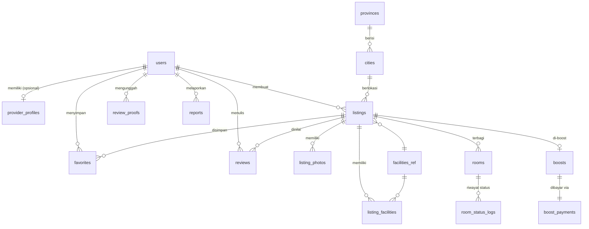
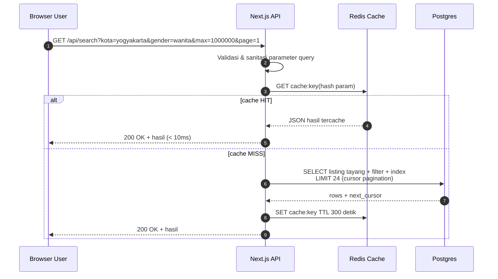
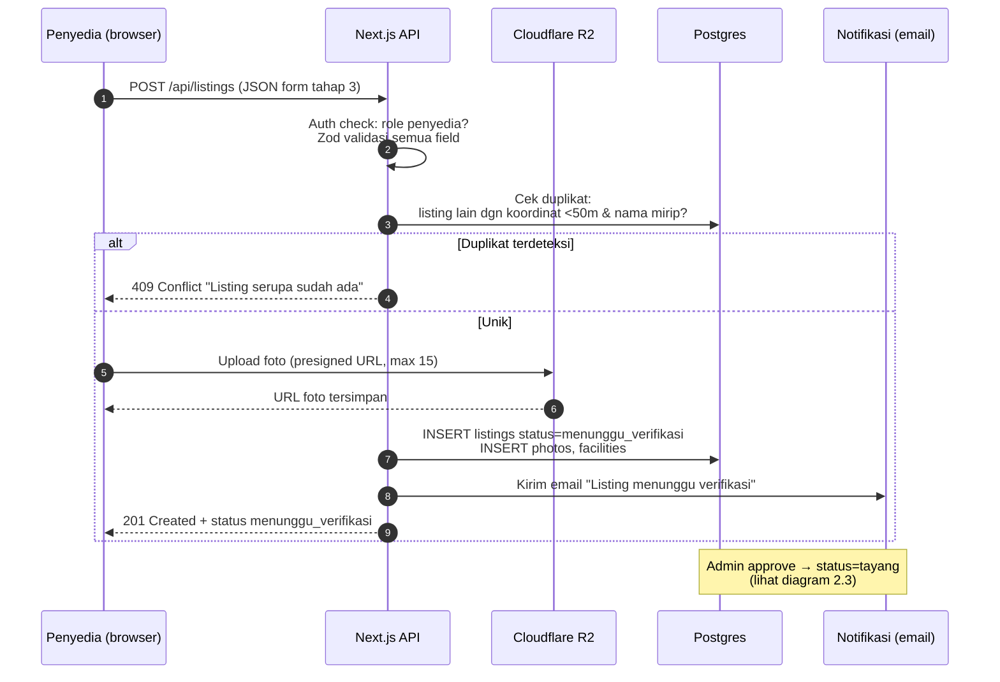
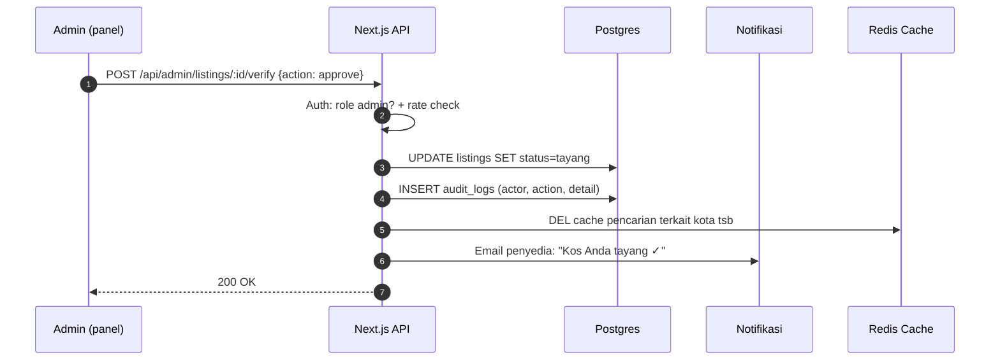
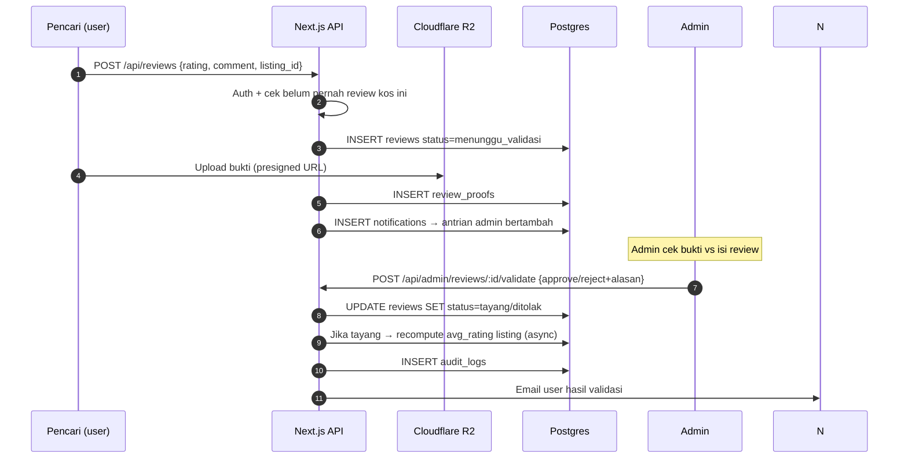
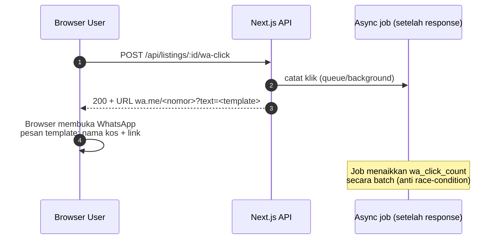

# Diagram Teknis — KosNet
**Versi:** 0.1 · **Tanggal:** 2026-08-25 · **Prasyarat:** PRD v0.2, Arsitektur §7 (keputusan final), Sistem Desain disetujui

Dokumen ini berisi:
1. **ERD** — skema database lengkap
2. **Sequence Diagram API Utama** — alur request backend untuk 4 proses kritis
3. **Struktur Folder Proyek** — siap diserahkan ke AI agent di VS Code
4. **Kontrak Data Penting** — aturan nilai/enum yang wajib konsisten

> Semua diagram pakai Mermaid (render di VS Code / GitHub). Setiap diagram diikuti paragraf **Penjelasan Alur**.

---

# BAGIAN 1 — ERD (Entity Relationship Diagram)



## 1.1 Detail Tabel

```mermaid
erDiagram
    users {
        uuid id PK
        text email UK "wajib unik, terverifikasi"
        text password_hash "bawaan Supabase Auth"
        text full_name
        text avatar_url
        text phone
        user_role role "pencari | penyedia | admin | superadmin"
        timestamptz created_at
        timestamptz suspended_at "NULL = aktif"
    }

    provider_profiles {
        uuid id PK
        uuid user_id FK "->users, unique"
        text whatsapp_number "nomor WA publik di listing"
        text bank_name "opsional: rekening utk DP"
        text bank_account_number "opsional"
        text bank_account_name "opsional"
    }

    provinces {
        int id PK
        text name "DKI Jakarta, DI Yogyakarta..."
    }
    cities {
        int id PK
        int province_id FK
        text name
    }

    listings {
        uuid id PK
        uuid owner_id FK "->users"
        int city_id FK "->cities"
        text name
        text address
        decimal latitude "untuk pin peta & deteksi duplikat"
        decimal longitude
        gender_type gender "pria | wanita | campur"
        int price_monthly "rupiah, integer"
        text description
        text special_note "catatan khusus: listrik terpisah dll"
        text rules "aturan kos free-text"
        listing_status status "draft|menunggu_verifikasi|revisi|tayang|ditolak|nonaktif|suspend"
        int view_count "denormalisasi, di-update async"
        int wa_click_count "denormalisasi"
        decimal avg_rating "denormalisasi dari reviews"
        int review_count "denormalisasi"
        timestamptz created_at
        timestamptz updated_at
    }

    listing_photos {
        uuid id PK
        uuid listing_id FK
        text url "Cloudflare R2"
        int sort_order "urutan tampil"
    }

    facilities_ref {
        int id PK
        text code "ac, wifi, km_dalam, parkir..."
        text label "AC, WiFi, KM Dalam..."
    }
    listing_facilities {
        uuid listing_id PK_FK
        int facility_id PK_FK
    }

    rooms {
        uuid id PK
        uuid listing_id FK
        int number "nomor kamar"
        room_status status "tersedia | dikunci | terisi"
        decimal price_override "NULL = ikut harga induk"
    }\
    room_status_logs {
        uuid id PK
        uuid room_id FK
        room_status old_status
        room_status new_status
        uuid changed_by FK "->users"
        timestamptz changed_at
    }

    favorites {
        uuid user_id PK_FK
        uuid listing_id PK_FK
        timestamptz created_at
    }

    reviews {
        uuid id PK
        uuid listing_id FK
        uuid author_id FK
        int rating "1..5 CHECK"
        text comment
        review_status status "menunggu_validasi | tayang | ditolak"
        text rejection_reason
        timestamptz created_at
        UNIQUE(listing_id, author_id) "1 review per user per kos"
    }
    review_proofs {
        uuid id PK
        uuid review_id FK
        uuid uploaded_by FK "->users"
        text image_url "bukti survey/kwitansi"
        proof_kind kind "foto_survey | kwitansi | bukti_menempati"
    }

    boosts {
        uuid id PK
        uuid listing_id FK "unique - satu boost aktif per listing"
        int duration_days "7 | 14 | 30"
        timestamptz starts_at
        timestamptz expires_at
        boost_status status "menunggu_bukti | menunggu_validasi | aktif | selesai | ditolak"
    }
    boost_payments {
        uuid id PK
        uuid boost_id FK "unique"
        text proof_image_url "upload bukti transfer oleh penyedia"
        text verified_by FK "->users (admin)"
        timestamptz verified_at
    }

    reports {
        uuid id PK
        uuid reporter_id FK "->users"
        report_target target_type "listing | review | user"
        uuid target_id
        text reason
        report_status status "open | resolved | dismissed"
        uuid handled_by FK "->users (admin)"
    }

    audit_logs {
        bigint id PK
        uuid actor_id FK "->users (admin/staff)"
        text action "approve_listing, reject_review, activate_boost..."
        jsonb detail "payload keputusan + alasannya"
        timestamptz created_at
    }

    notifications {
        uuid id PK
        uuid user_id FK
        text title
        text body
        boolean is_read
        timestamptz created_at
    }
```

### Penjelasan Skema
1. **`listings` menyimpan angka denormalisasi** (`view_count`, `avg_rating`, `review_count`) supaya kartu hasil pencarian tidak perlu JOIN hitung — ini bagian dari strategi anti-down (dokumen arsitektur §4). Counter di-update secara async, bukan realtime.
2. **`rooms` dipisah dari `listings`** karena PRD mensyaratkan status per kamar (Tersedia/Dikunci/Terisi) yang diubah manual pemilik. `room_status_logs` mencatat setiap perubahan — jejak siapa mengubah apa, penting kalau ada sengketa dengan penyewa.
3. **Review punya dua tabel**: `reviews` (isi) + `review_proofs` (bukti fisik yang divalidasi admin) — sesuai keputusan final anti-review-palsu. Constraint UNIQUE mencegah 1 orang spam banyak review untuk kos sama.
4. **`boosts` + `boost_payments` terpisah** agar riwayat pembayaran boost lama tidak hilang saat boost baru dibeli.
5. **`audit_logs`** = kewajiban security dari arsitektur §5: semua aksi admin tercatat permanen.
6. **`provinces` & `cities` adalah data master statis** (seed sekali) — cocok di-cache penuh di Redis.

---

# BAGIAN 2 — SEQUENCE DIAGRAM API UTAMA

## 2.1 Pencarian Listing (endpoint paling sering dipukul)


**Penjelasan Alur:** ini endpoint terpanas platform — dilindungi cache 5 menit sehingga ribuan user serentak hanya menghasilkan 1 query DB per kombinasi filter. Parameter divalidasi ketat sebelum masuk DB (anti SQL injection). Pagination cursor-based agar halaman ke-N tetap cepat.

## 2.2 Submit Listing Baru (penyedia)


**Penjelasan Alur:** validasi ganda (auth + Zod schema) sebelum sentuh DB. Deteksi duplikat otomatis memblokir spam listing kembar SEBELUM admin repot. Foto tidak lewat server app — browser upload langsung ke R2 pakai presigned URL, hemat resource server.

## 2.3 Verifikasi Listing oleh Admin


**Penjelasan Alur:** setiap keputusan admin WAJIB menulis `audit_logs` dalam transaksi yang sama dengan perubahan status — tidak bisa ada approve tanpa jejak. Cache pencarian langsung di-invalidasi agar listing baru muncul segera (tidak menunggu TTL 5 menit).

## 2.4 Ajukan Review + Validasi Admin


**Penjelasan Alur:** review MASUK sebagai draft `menunggu_validasi` — tidak pernah tampil publik sebelum buktinya lolos admin. Rating rata-rata listing dihitung ulang async (background) supaya request user tetap ringan. Penolakan wajib beralasan → dikirim ke user agar bisa ajukan ulang.

## 2.5 Klik Tombol WhatsApp (tracking)


**Penjelasan Alur:** tracking klik WA sengaja async — pengguna tidak boleh menunggu penulisan statistik; mereka langsung dilempar ke WhatsApp. Counter naik via batch update agar tidak terjadi race condition saat ratusan klik bersamaan.

---

# BAGIAN 3 — STRUKTUR FOLDER PROYEK

```
kosnet/
├── README.md                  ← panduan setup untuk AI agent & manusia
├── package.json               ← Next.js 14+, TypeScript, Tailwind
├── .env.example               ← daftar env var (TANPA nilai asli)
├── docs/                      ← copy dokumen tahap 1-4 ini (acuan AI agent!)
│   ├── 01-PRD.md
│   ├── 02-Arsitektur-TechStack.md
│   ├── 03-Sistem-Desain.md
│   └── 04-Diagram-Teknis.md
├── public/
│   └── icons/
├── src/
│   ├── app/                       # App Router (routing)
│   │   ├── (publik)/
│   │   │   ├── page.tsx           # Beranda
│   │   │   ├── cari/page.tsx      # Hasil pencarian + filter
│   │   │   └── kos/[id]/page.tsx  # Detail kos (SSR + SEO)
│   │   ├── (auth)/login|daftar/
│   │   ├── dashboard/pencari/     # profil, tersimpan, review-saya
│   │   ├── dashboard/penyedia/    # statistik, kelola-kos, boost
│   │   └── admin/                 # panel admin (protected)
│   ├── modules/                   # MODULAR MONOLITH — logika per domain
│   │   ├── auth/
│   │   ├── listing/
│   │   ├── search/
│   │   ├── review/
│   │   ├── favorite/
│   │   ├── boost/
│   │   ├── report/
│   │   ├── notification/
│   │   └── admin/
│   │       └── (masing-masing:)
│   │           ├── service.ts     # business logic
│   │           ├── schema.ts      # validasi Zod
│   │           └── api.ts         # route handlers
│   ├── components/                # UI reusable (dari Sistem Desain Bagian 2)
│   │   ├── listing-card.tsx
│   │   ├── facility-badge.tsx
│   │   ├── wa-button.tsx
│   │   ├── special-note.tsx
│   │   ├── filter-bar.tsx
│   │   └── ui/                    # shadcn primitives
│   ├── lib/                       # shared infra
│   │   ├── db.ts                  # koneksi Supabase/Drizzle
│   │   ├── redis.ts               # client Upstash
│   │   ├── storage.ts             # presigned URL R2
│   │   ├── cache.ts               # helper get/set/invalidate
│   │   └── ratelimit.ts
│   ├── types/                     # enum & tipe global (gender_type, dst.)
│   └── config/
├── supabase/
│   ├── migrations/                # skema DB versi-by-versi
│   └── seed.sql                   # provinces, cities, facilities_ref
└── tests/
```

### Penjelasan Struktur
- **Aturan emas untuk AI agent di VS Code:** *business logic HANYA di `src/modules/*`, routing HANYA di `src/app/*`, komponen HANYA di `src/components/*`.* Batas modul jelas = mudah di-scale nanti (arsitektur §1).
- **`docs/` ikut dalam repo** — AI agent bisa membaca PRD/desain sebagai konteks saat build fitur.
- **Migrasi DB selalu lewat file `supabase/migrations/`**, jangan ubah skema manual di dashboard — agar reproducible.

---

# BAGIAN 4 — KONTRAK DATA PENTING (ENUM)

| Enum | Nilai | Catatan |
|---|---|---|
| `user_role` | `pencari` · `penyedia` · `admin` · `superadmin` | 1 user bisa pencari+penyedia; field role menyimpan role tertinggi |
| `gender_type` | `pria` · `wanita` · `campur` | Filter kategori kos |
| `listing_status` | `draft` → `menunggu_verifikasi` → `revisi`/`tayang`/`ditolak` → `nonaktif`/`suspend` | Urutan = state machine verifikasi |
| `room_status` | `tersedia` · `dikunci` · `terisi` | Diubah manual oleh pemilik |
| `review_status` | `menunggu_validasi` · `tayang` · `ditolak` | Wajib ≥1 proof sebelum bisa tayang |
| `boost_status` | `menunggu_bukti` → `menunggu_validasi` → `aktif` → `selesai`/`ditolak` | Aktivasi manual admin |

### Penjelasan Kontrak
Enum ini adalah **sumber kebenaran tunggal** — didefinisikan sekali di `src/types/` dan dipakai di schema validasi, database constraint, DAN badge warna UI (Sistem Desain §1.1: biru/kuning/merah). Konsistensi tiga lapis ini mencegah bug klasik "status beda nama antar layer".

---
*Dokumen perencanaan selesai (tahap 1–4). Langkah build: serahkan folder `kos-platform/` ke AI agent di VS Code dengan instruksi mulai dari struktur folder Bagian 3.*
